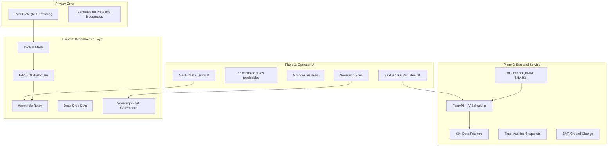
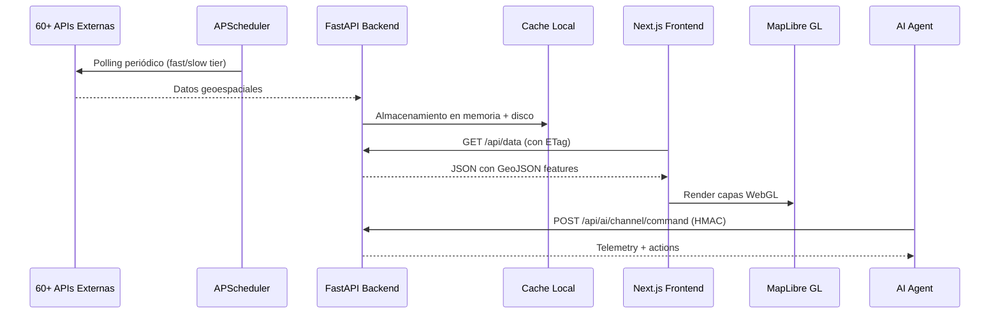

# 🛰️ Análisis del Software —SistemaHidrico

## Resumen Ejecutivo

**SistemaHidrico** es una plataforma de inteligencia geoespacial en tiempo real de código abierto (AGPL-3.0) que agrega **60+ fuentes de datos OSINT** (Open Source Intelligence) en una única interfaz de mapa interactivo. Está diseñada para analistas, investigadores, operadores de radio y cualquier persona interesada en visualizar señales públicas globales en un solo lugar.

> [!IMPORTANT]
> Este no es un software de vigilancia nuevo — agrega y visualiza datasets públicos existentes (ADS-B, AIS, TLE, GDELT, etc.). No recolecta datos de usuario.

---

## 📊 Métricas del Código

| Métrica | Valor |
|---|---|
| **Archivos fuente totales** | ~738 |
| **Líneas de código totales** | ~274,151 |
| **Python (Backend)** | ~169,639 líneas |
| **TypeScript/TSX (Frontend)** | ~96,080 líneas |
| **Rust (Privacy Core)** | ~7,670 líneas |
| **Tamaño del repositorio** | ~30 MB (sin node_modules) |
| **Versión actual** | v0.9.75 |
| **Licencia** | GNU AGPL v3 |

---

## 🏗️ Arquitectura General

El sistema tiene una arquitectura de **tres planos verticales** + dos puentes transversales:



---

## 🔧 Stack Tecnológico

### Frontend
| Tecnología | Versión | Uso |
|---|---|---|
| **Next.js** | 16.1.6 | Framework React SSR |
| **React** | 19.2.4 | UI Library |
| **MapLibre GL** | 4.7.1 | Motor de mapas WebGL |
| **react-map-gl** | 8.1.0 | Wrapper React para MapLibre |
| **Framer Motion** | 12.38.0 | Animaciones |
| **satellite.js** | 6.0.2 | Propagación orbital SGP4 |
| **Tailwind CSS** | 4.x | Estilos |
| **hls.js** | 1.6.15 | Streaming video HLS |
| **Zod** | 4.3.6 | Validación de esquemas |
| **Vitest** | 4.1.0 | Testing |

### Backend
| Tecnología | Versión | Uso |
|---|---|---|
| **FastAPI** | 0.115.12 | Framework API REST |
| **Uvicorn** | 0.34.0 | Servidor ASGI |
| **APScheduler** | 3.10.3 | Polling de datos programado |
| **httpx** | 0.28.1 | Cliente HTTP async |
| **Pydantic** | 2.13.3 | Validación de datos |
| **orjson** | 3.10+ | Serialización JSON rápida |
| **sgp4** | 2.25 | Cálculos orbitales de satélites |
| **PyNaCl** | 1.5+ | Criptografía Ed25519/X25519 |
| **Playwright** | 1.59.0 | Web scraping |
| **meshtastic** | 2.5+ | Integración radio mesh |
| **paho-mqtt** | 1.6+ | Cliente MQTT |
| **slowapi** | 0.1.9 | Rate limiting |
| **yfinance** | 1.3.0 | Datos de mercados |

### Privacy Core (Rust)
| Tecnología | Uso |
|---|---|
| **mls-rs** (AWS Labs) | Protocolo MLS para messaging |
| **wasm-bindgen** | Compilación a WebAssembly |
| **sha2** | Hashing SHA-256 |
| **zeroize** | Limpieza segura de memoria |
| **serde/serde_json** | Serialización |

### Infraestructura
| Tecnología | Uso |
|---|---|
| **Docker / Docker Compose** | Containerización |
| **Helm / Kubernetes** | Despliegue HA |
| **Tauri** | App de escritorio nativa |
| **GitHub Actions** | CI/CD |
| **GHCR** | Container Registry |

---

## 📁 Estructura del Proyecto

```
SistemaHidrico/
├── backend/                    # Servidor API Python
│   ├── main.py                 # Punto de entrada (~11,547 líneas!)
│   ├── auth.py                 # Autenticación y autorización (~61K)
│   ├── routers/                # 17 routers FastAPI
│   │   ├── ai_intel.py         # Canal agéntico AI (~160K)
│   │   ├── mesh_public.py      # API mesh pública (~86K)
│   │   ├── wormhole.py         # Relay Wormhole (~55K)
│   │   ├── data.py             # Datos geoespaciales
│   │   ├── cctv.py             # Cámaras CCTV
│   │   ├── sar.py              # SAR ground-change
│   │   └── ...
│   ├── services/               # 52+ servicios + 4 subdirectorios
│   │   ├── data_fetcher.py     # Orquestador de polling (~42K)
│   │   ├── telemetry.py        # Telemetría principal (~83K)
│   │   ├── cctv_pipeline.py    # Pipeline CCTV 11K+ cámaras (~43K)
│   │   ├── openclaw_channel.py # Bridge AI agéntico (~67K)
│   │   ├── privacy_claims.py   # Claims de privacidad (~78K)
│   │   ├── mesh/               # 46 archivos - Stack mesh completo
│   │   │   ├── mesh_hashchain.py       # Cadena de hash (~118K)
│   │   │   ├── mesh_wormhole_root_manifest.py  # (~104K)
│   │   │   ├── mesh_gate_mls.py        # MLS para gates (~95K)
│   │   │   ├── mesh_wormhole_contacts.py # Contactos (~83K)
│   │   │   └── ...
│   │   ├── infonet/            # Gobernanza descentralizada
│   │   │   ├── governance/     # Peticiones, upgrades
│   │   │   ├── markets/        # Mercados de resolución
│   │   │   ├── privacy/        # Contratos de privacidad
│   │   │   └── bootstrap/      # Bootstrap del sistema
│   │   ├── sar/                # Detección de cambios SAR
│   │   └── fetchers/           # Fetchers específicos
│   ├── tests/                  # 35+ archivos de test
│   └── data/                   # Datos estáticos
│
├── frontend/                   # Interfaz Next.js
│   ├── src/
│   │   ├── app/                # Next.js App Router
│   │   │   ├── page.tsx        # Página principal (~42K)
│   │   │   └── api/            # API routes (proxy)
│   │   ├── components/         # 35+ componentes React
│   │   │   ├── MaplibreViewer.tsx    # Mapa principal (~259K!)
│   │   │   ├── MeshTerminal.tsx      # Terminal mesh (~254K!)
│   │   │   ├── SettingsPanel.tsx     # Panel de ajustes (~145K)
│   │   │   ├── NewsFeed.tsx          # Feed de noticias (~135K)
│   │   │   ├── AIIntelPanel.tsx      # Panel AI (~90K)
│   │   │   └── ...
│   │   ├── hooks/              # React hooks personalizados
│   │   ├── mesh/               # Lógica mesh del cliente
│   │   ├── lib/                # Utilidades
│   │   └── types/              # Definiciones TypeScript
│   └── public/                 # Assets estáticos
│
├── privacy-core/               # Crate Rust → WASM
│   ├── Cargo.toml
│   └── src/lib.rs              # Implementación MLS (~7,670 líneas)
│
├── desktop-shell/              # App Tauri de escritorio
│   ├── src/                    # Bridge TypeScript
│   └── tauri-skeleton/         # Configuración Tauri
│
├── openclaw-skills/            # SDK para agentes AI
│   └── SistemaHidrico/
│       ├── sb_query.py         # Queries de datos (~51K)
│       ├── sb_monitor.py       # Monitoreo (~29K)
│       ├── sb_briefing.py      # Informes de inteligencia
│       ├── sb_alerts.py        # Alertas (Discord/Telegram)
│       ├── sb_signatures.py    # Firmas HMAC
│       └── SKILL.md            # Documentación del skill
│
├── docs/mesh/                  # Documentación del mesh
│   ├── threat-model.md         # Modelo de amenazas
│   └── claims-reconciliation.md # Reconciliación de claims
│
├── helm/chart/                 # Helm chart para K8s
├── scripts/                    # Scripts operacionales
├── docker-compose.yml          # Despliegue Docker
├── start.sh / start.bat        # Lanzadores locales
└── README.md                   # Documentación (~74K, 1007 líneas)
```

---

## 🗺️ Capas de Datos (37 Capas Toggleables)

### Aviación
- Vuelos comerciales (OpenSky Network, ~5,000+ aeronaves)
- Aeronaves privadas y jets privados con identificación de propietario
- Vuelos militares (adsb.lol — tankers, ISR, cazas)
- Detección de patrones de holding (>300° de giro total)
- Detección de GPS Jamming (análisis NAC-P)

### Marítimo
- 25,000+ buques AIS en tiempo real (WebSocket)
- Portaaviones US Navy (estimación por scraping GDELT)
- Fishing Activity (Global Fishing Watch)
- Yates de billonarios rastreados

### Espacio
- 2,000+ satélites con propagación SGP4 (CelesTrak TLE)
- Clasificación por tipo de misión (recon, SIGINT, SAR, etc.)
- SatNOGS + TinyGS ground stations

### Geopolítica y Conflicto
- Eventos GDELT (~1,000 eventos / 8 horas)
- Línea del frente de Ucrania (DeepState Map)
- Alertas aéreas de Ucrania
- Dossier por país (right-click en cualquier punto)

### Vigilancia y SIGINT
- 11,000+ cámaras CCTV en 6 países
- 500+ receptores KiwiSDR con tuner embebido
- Police/fire scanner feeds (OpenMHZ)
- Meshtastic mesh radio + APRS amateur radio

### Medio Ambiente
- NASA FIRMS fire hotspots (VIIRS)
- Earthquakes (USGS)
- Volcanes, calidad del aire, clima severo
- Space weather (NOAA Kp index)

### Infraestructura
- Internet outages (IODA)
- 2,000+ data centers
- Bases militares globales
- 35,000+ plantas de energía

### Imágenes Satelitales
- NASA GIBS (MODIS Terra)
- Esri World Imagery (sub-metro)
- Sentinel-2 (10m resolución)
- SAR ground-change detection (NASA OPERA / Copernicus)
- VIIRS Nightlights

---

## 🔐 Análisis de Seguridad

### Modelo de Autenticación
| Componente | Mecanismo |
|---|---|
| **Admin endpoints** | `X-Admin-Key` header (HMAC comparison) |
| **Scoped tokens** | Token-per-scope con verificación HMAC |
| **AI Channel** | HMAC-SHA256 (`METHOD\|path\|timestamp\|nonce\|sha256(body)`) |
| **Mesh signing** | Ed25519 canonical payload signing |
| **DM encryption** | X25519 DH + AESGCM + HKDF |
| **Docker Secrets** | Soporte para `_FILE` env vars (Swarm) |

### Observaciones de Seguridad

> [!WARNING]
> **Archivos monolíticos enormes**: `main.py` tiene **11,547 líneas** y `MaplibreViewer.tsx` tiene **259K bytes**. Esto dificulta la auditoría de seguridad.

> [!CAUTION]
> **InfoNet es un testnet experimental**: Los mensajes están ofuscados pero **NO** cifrados end-to-end. No enviar información sensible por ningún canal.

- **Buenas prácticas observadas**:
  - Rate limiting con slowapi
  - CORS configurable
  - HMAC con protección contra replay (timestamp + nonce)
  - Validación de esquemas con Pydantic/Zod
  - Tests de seguridad dedicados (`test_p0_security.py`, `test_openclaw_route_security.py`)
  - Privacy claims system que valida qué se puede afirmar sobre privacidad
  - Docker con límites de memoria y healthchecks

- **Preocupaciones**:
  - El `ALLOW_INSECURE_ADMIN` mode existe (aunque solo para debug)
  - `main.py` concentra demasiada lógica — superficie de ataque difícil de auditar
  - Dependencia de `cloudscraper` para eludir protecciones anti-bot
  - Las credenciales MQTT de Meshtastic están hardcodeadas en docker-compose: `meshdev`/`large4cats`

---

## 🧩 Componentes Principales en Detalle

### 1. Data Fetcher (`services/data_fetcher.py`)
Orquestador central que usa APScheduler con dos tiers:
- **Fast tier**: Datos que se actualizan cada ~60s (vuelos, barcos, satélites, earthquakes)
- **Slow tier**: Datos menos frecuentes (CCTV, GDELT, bases militares, etc.)
- Soporta caché de arranque para pintar datos desde el último snapshot local

### 2. Canal Agéntico AI (`services/openclaw_channel.py` + `routers/ai_intel.py`)
- Protocolo abierto que cualquier agente AI puede usar (no solo OpenClaw)
- `POST /api/ai/channel/command` — comando individual
- `POST /api/ai/channel/batch` — hasta 20 comandos concurrentes
- Tier-gated: `restricted` (solo lectura) vs `full` (lectura + escritura + inyección)
- El agente puede: colocar pins, controlar el mapa, consultar datos, enviar alertas

### 3. Mesh/InfoNet (`services/mesh/`)
El componente más complejo del sistema (46 archivos, ~1.3M bytes):
- **Hashchain**: Cadena de eventos firmados con Ed25519
- **Two-tier finality**: Tier 1 CRDT (baja latencia) + Tier 2 (finalidad por epoch)
- **Gate personas**: Identidades pseudónimas con prekey bundles
- **Dead Drop DMs**: Mailboxes basados en token con epoch rotation
- **Wormhole relay**: Capa de transporte con ofuscación

### 4. Sovereign Shell (Gobernanza)
- Peticiones con DSL tipado (UPDATE_PARAM, ENABLE_FEATURE, etc.)
- Upgrade-Hash voting (80% supermajority, 40% quorum)
- Mercados de resolución y disputa con staking
- Bootstrap: primeros 100 mercados usan one-vote-per-eligible-node

### 5. Privacy Core (Rust → WASM)
- Implementa MLS (Message Layer Security) via `mls-rs` de AWS Labs
- Compilable a WASM para uso en el frontend
- Contratos de protocolo bloqueados para: ring signatures, stealth addresses, Pedersen commitments
- Las primitivas criptográficas finales aún no han sido elegidas

### 6. SAR Ground-Change Detection
- **Modo A**: Catálogo Sentinel-1 de Alaska Satellite Facility (gratis, sin cuenta)
- **Modo B**: NASA OPERA / Copernicus EGMS para anomalías reales (requiere cuenta NASA Earthdata)
- Detección de: deformación del terreno, cambios en agua, perturbación de vegetación, daños

---

## 📝 Observaciones de Calidad del Código

### Fortalezas
- ✅ Documentación README extremadamente detallada (1,007 líneas)
- ✅ Suite de tests sustancial (35+ archivos backend + tests frontend con Vitest)
- ✅ Soporte multi-plataforma (Docker, Helm/K8s, local, Tauri desktop)
- ✅ Arquitectura modular con routers separados
- ✅ Privacy claims system que previene afirmaciones de privacidad incorrectas
- ✅ Modelo de amenazas documentado (`docs/mesh/threat-model.md`)
- ✅ Perfiles de release que controlan qué features están activas
- ✅ Docker con healthchecks, resource limits, multi-arch (amd64 + arm64)

### Debilidades

> [!WARNING]
> **Deuda técnica significativa reconocida por los autores** — el `pyproject.toml` deshabilita múltiples reglas de Ruff y Black tiene `force-exclude = ".*"` para evitar reformatear todo.

- ⚠️ **`main.py` monolítico**: 11,547 líneas en un solo archivo es insostenible
- ⚠️ **Componentes frontend gigantes**: `MaplibreViewer.tsx` (259K), `MeshTerminal.tsx` (254K), `SettingsPanel.tsx` (145K)
- ⚠️ **Sin tipado estricto en Python**: Muchas funciones usan `dict[str, Any]` genérico
- ⚠️ **Linting relajado**: Se ignoran F401 (imports no usados), F841 (variables no usadas), etc.
- ⚠️ **Sin Black formatting**: Deshabilitado completamente para evitar rewrite masivo
- ⚠️ **Acoplamiento fuerte**: `main.py` importa directamente de múltiples servicios mesh

---

## 🔄 Flujo de Datos



---

## 🚀 Cómo Ejecutar

### Docker (Recomendado)
```bash
cd SistemaHidrico
docker compose pull
docker compose up -d
# Abrir http://localhost:3000
```

### Desarrollo Local
```bash
# Backend
cd backend
python -m venv venv && source venv/bin/activate
pip install .
# Crear .env con API keys

# Frontend
cd ../frontend
npm ci
npm run dev  # Inicia ambos servidores
```

### APIs Requeridas
- **AIS_API_KEY** (aisstream.io) — obligatoria para barcos
- **OPENSKY_CLIENT_ID/SECRET** — muy recomendada para cobertura global de vuelos

---

## 🎯 Conclusión

SistemaHidrico es un proyecto **ambicioso y maduro** que integra una cantidad impresionante de fuentes de datos OSINT en una interfaz unificada. Los puntos clave:

1. **Escala**: ~274K líneas de código, 60+ fuentes de datos, 37 capas interactivas
2. **Complejidad**: La capa mesh descentralizada (InfoNet) con gobernanza, criptografía y protocolos de privacidad es particularmente sofisticada
3. **Deuda técnica**: Archivos monolíticos enormes que necesitan refactorización
4. **Seguridad**: Modelo de autenticación robusto con HMAC, pero la complejidad del código dificulta la auditoría
5. **Estado**: Testnet experimental — las features de privacidad no están completas y el sistema **no debe usarse para comunicaciones sensibles**

> [!NOTE]
> El proyecto está en desarrollo activo (v0.9.75) y tiene un roadmap claro hacia criptografía completa (Sprint 11+), pero las primitivas de privacidad aún no han sido elegidas ni implementadas.
